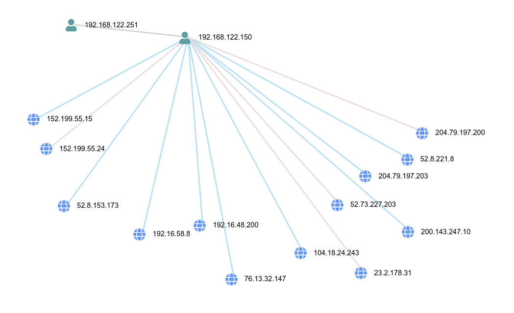

# Objetivo
Objetivo dessa prova é analisar o trafego de rede dado pelo professo

# IPS ENVOLVIDOS
Foram obtidos os ips de todos os envolvidos no trafego com o seguinte comando

`tcpdump -n -r attack-trace.pcap | cut -d' ' -f3,5 | sed -e 's/ /\n/g' |
cut -d. -f-4 | sort -u`

Os ips envolvidos são esses:
```
104.18.24.243
152.199.55.15
152.199.55.24
192.16.48.200
192.16.58.8
192.168.122.150
192.168.122.251
200.143.247.10
204.79.197.200
204.79.197.203
23.2.178.31
52.73.227.203
52.8.153.173
52.8.221.8
76.13.32.147
```

## Informações obtidas dos ips

Essas informações foram obtidas com o comando `whois`

```
104.18.24.243
OrgName:        Cloudflare, Inc.
OrgId:          CLOUD14
Address:        101 Townsend Street
City:           San Francisco
```
```
152.199.55.15
152.199.55.24
OrgName:        ANS Communications, Inc
OrgId:          ANS
Address:        22001 Loudoun County Parkway
City:           Ashburn
```
```
192.16.48.200
192.16.58.8
192.168.122.150
192.168.122.251
OrgName:        Edgecast Inc.
OrgId:          EDGEC-25
Address:        13031 W Jefferson Blvd. Building 900
City:           Los Angeles
```
```
200.143.247.10
204.79.197.200
204.79.197.203
OrgName:        Microsoft Corporation
OrgId:          MSFT
Address:        One Microsoft Way
City:           Redmond
```
```
23.2.178.31
OrgName:        Akamai Technologies, Inc.
OrgId:          AKAMAI
Address:        145 Broadway
City:           Cambridge
```
```
52.73.227.203
52.8.153.173
52.8.221.8
OrgName:        Amazon Technologies Inc.
OrgId:          AT-88-Z
Address:        410 Terry Ave N.
City:           Seattle
```
```
76.13.32.147
OrgName:        Oath Holdings Inc.
OrgId:          OH-207
Address:        770 BROADWAY FL 4
City:           New York
```

# Numero de sessões
```
p0f -r attack-trace.pcap | grep "syn+ack" | wc -l

64
```
Foram 64 sessões tcp analisadas

# Tempo do ataque

Com o seguinte comando é possível obter o tempo do início da captura
```
tcpdump -n -r attack-trace.pcap | cut -d' ' -f1 | head -n 1
reading from file attack-trace.pcap, link-type EN10MB (Ethernet), snapshot length 262144
08:41:10.333828
```

Com o seguinte comando é possível obter o tempo do final da captura
```
tcpdump -n -r attack-trace.pcap | cut -d' ' -f1 | tail -n 1
reading from file attack-trace.pcap, link-type EN10MB (Ethernet), snapshot length 262144
08:43:33.250140
```

Com isso podemos saber que o ataque demorou 2 minutos.

# Arquivos envolvidos

Arquivos envolvidos nessa captura estão disponíveis na pasta `arquivos` que foi enviada 
junto desse pdf.
Foi possível obter esses arquivos com o programa [_wireshark_](https://www.wireshark.org/)

Os arquivos foram todos inpecionados pelo site [_virustotal_](https://www.virustotal.com/)
e nenhum deles tras alguma ressalva com excessão do que está nomeado como 
`pt-br&Red3=MSAOL_pd`. Esse arquivo aparenta não ser malicioso sozinho, porém aparenta
ser comunmente enviado junto de arquivos maliciosos de acordo com o usuário
[_sectestso do virustotal_](https://www.virustotal.com/gui/file/99c2917ee5b2a01459a923bdd1c676f15ee73b62b87f696e6735312d26f51e12/community).

Além disso é possível observar que foram enviados dois certificados digitais da microsoft
, caso seja um ataque é possível que sejam certificados falsificados para que possa ser
enviado algum arquivo malicioso sem a vítima suspeitar.

\pagebreak
# Outras informações obtidas

Utilizando o website [_apackets.com](https://apackets.com/) foi possível obter esse grafo
das conexões que foram feitas nessa captura.




Olhando ainda as informações geradas pelo site [_apackets.com](https://apackets.com/) é
possível ver que todas as requisições http são get, comportamento que pode ser de alguem
usando um navegador. Como várias imagens e gifs são baixados, é possível que seja alguem
explorando páginas na internet.
